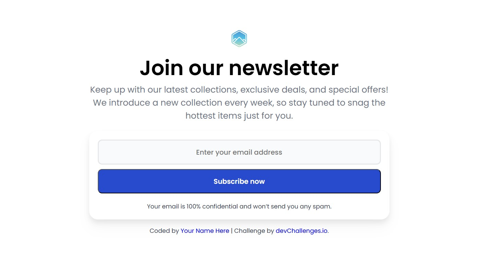
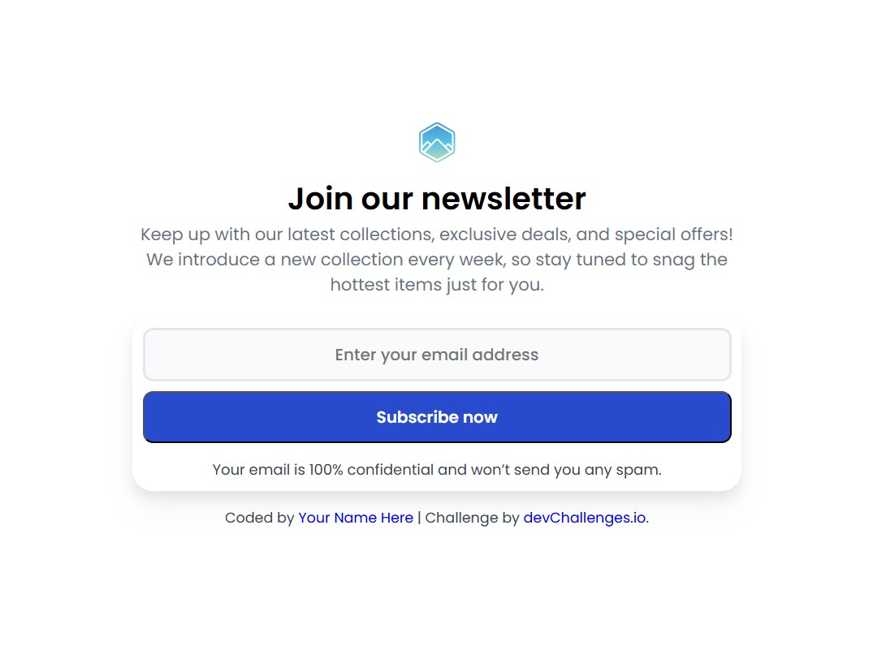
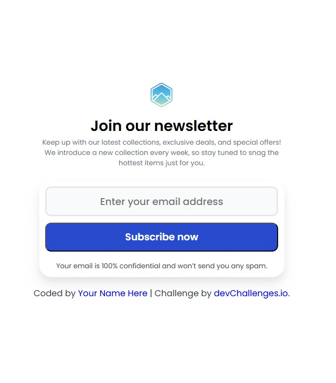

<h1 align="center">Join Our Newsletter | devChallenges</h1>

   Solution for a challenge <a href="https://devchallenges.io/challenges/llKNYzM9xi8d3RmykVf6" target="_blank">Join Our Newsletter</a> from <a href="https://devchallenges.io" target="_blank">devChallenges.io</a>.

  <h3>
    <a href="https://icabduqaadir12.github.io/join-our-newsletter-master/">
      Demo
    </a>
     | 
    <a href="https://github.com/icabduqaadir12/join-our-newsletter-master">
      Solution
    </a>
     | 
    <a href="https://devchallenges.io/challenges/llKNYzM9xi8d3RmykVf6">
      Challenge
    </a>
  </h3>

---

## Table of Contents

- [Overview](#overview)
  - [Screenshots](#screenshots)
  - [What I Learned](#what-i-learned)
  - [Useful Resources](#useful-resources)
- [Built With](#built-with)
- [Features](#features)
- [Acknowledgements](#acknowledgements)
- [Author](#author)

---

## Overview

A responsive newsletter sign-up form built with pure HTML and CSS. This is a submission for the [Join Our Newsletter](https://devchallenges.io/challenges/llKNYzM9xi8d3RmykVf6) challenge on devChallenges.io. The layout adapts smoothly across desktop, tablet, and mobile devices.

### Screenshots

| Desktop                            | Tablet                            | Mobile                            |
|-----------------------------------|-----------------------------------|-----------------------------------|
|  |  |  |

> 💡 *Add a thumbnail image like `design/thumbnail.jpg` for a featured preview if desired.*

---

### What I Learned

- How to build a fully responsive UI from a design file
- Structuring semantic HTML5 forms
- Styling layouts using Flexbox and media queries
- Maintaining consistent spacing and typography
- Publishing projects with GitHub Pages

---

### Useful Resources

- [MDN Web Docs](https://developer.mozilla.org/) – Reference for HTML and CSS
- [CSS Tricks – Flexbox Guide](https://css-tricks.com/snippets/css/a-guide-to-flexbox/)
- [devChallenges.io Community](https://discord.gg/devchallenges) – Great for feedback and learning

---

## Built With

- Semantic HTML5
- CSS3 (with custom properties)
- Flexbox
- Media queries
- Mobile-first approach
- [Google Fonts](https://fonts.google.com/)

---

## Features

- Newsletter sign-up layout
- Fully responsive: Desktop → Tablet → Mobile
- Static form design (no JavaScript)
- Clean, accessible design

---

## Acknowledgements

- [devChallenges.io](https://devchallenges.io) for the design and challenge idea
- GitHub Pages for deployment
- Google Fonts for typography

---

## Author

- GitHub: [@icabduqaadir12](https://github.com/icabduqaadir12)
- Live Site: [icabduqaadir12.github.io/join-our-newsletter-master](https://icabduqaadir12.github.io/join-our-newsletter-master/)
